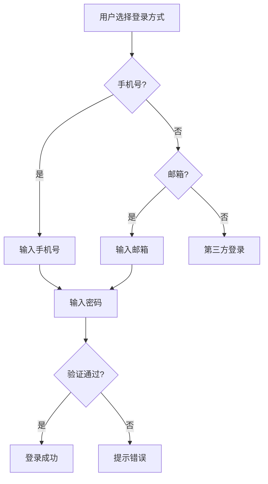

# 实战案例：用5分钟完成半天的工作量

> 这是「Claude Code Skills 教程系列」的第 7 篇。本系列将带你从零开始，完整掌握 Claude Code Skills 这一革命性功能。

---

## 一、从理论到实践

前6篇文章，我们讲了概念、机制、原理、技巧。

今天换个方式。

我用三个真实的案例，展示Skills在日常工作中的威力。不是理论推导，都是我实际用过的。

先看结果：

- **案例1**：PRD从半天到5分钟
- **案例2**：代码审查从2小时到10分钟
- **案例3**：多平台发布从1小时到15分钟

没夸张，都是实际数据。

---

## 二、案例一：PRD自动生成 - 半天的工作5分钟搞定

### 场景描述

每周一早上，产品经理开了2小时需求会。

你手里一堆会议记录：

```
- 用户登录要支持手机号和邮箱
- 密码要有强度要求
- 第三方登录做微信和Google
- 找回密码发验证码
- ...
```

老板下午就要PRD。

按照传统流程：
1. 整理会议记录 - 30分钟
2. 梳理需求逻辑 - 1小时
3. 画流程图 - 30分钟
4. 写完整PRD - 1.5小时
5. 检查遗漏 - 30分钟

**总计：约4小时**

而且每次都要重复这个流程。

### 技能设计

我创建了一个`prd-generator`技能：

```
prd-generator/
├── SKILL.md
├── references/
│   ├── prd-template.md      # PRD模板
│   ├── requirement-checklist.md  # 需求检查清单
│   └── user-story-examples.md    # 用户故事示例
└── examples/
    ├── login-prd-sample.md
    └── payment-prd-sample.md
```

**SKILL.md核心内容**：

```yaml
---
name: prd-generator
description: 将需求整理成规范的产品需求文档（PRD），包含用户故事、功能列表、流程图、异常处理等
---

# PRD生成器

## 触发条件
当用户提供会议记录、需求列表、用户反馈等需求信息时，自动使用此技能

## 输出结构
1. 需求背景与目标
2. 用户角色定义
3. 用户故事（User Story）
4. 功能列表与优先级
5. 流程图描述
6. 异常处理
7. 非功能需求
8. 验收标准

## 模板位置
详见 [PRD_TEMPLATE.md](references/prd-template.md)
```

**PRD模板**（`prd-template.md`）：

```markdown
# [功能名称] PRD

## 1. 需求背景
- 业务背景：
- 用户痛点：
- 解决方案：

## 2. 需求目标
- 核心目标：
- 成功指标：
- 不做事项：

## 3. 用户角色
| 角色 | 描述 | 典型场景 |
|------|------|---------|
|      |      |         |

## 4. 用户故事
作为 [角色]，我想要 [功能]，以便 [价值]

### P0（必须有）
- [ ] 故事1
- [ ] 故事2

### P1（重要）
- [ ] 故事3
- [ ] 故事4

## 5. 功能列表
### 5.1 功能模块A
- 功能点1
- 功能点2
- 异常处理：
  - 情况1 → 处理方式
  - 情况2 → 处理方式

## 6. 流程图
[用文字描述流程或生成Mermaid代码]

## 7. 非功能需求
- 性能要求：
- 安全要求：
- 兼容性要求：

## 8. 验收标准
- [ ] 功能完整性
- [ ] 用户体验
- [ ] 性能达标
- [ ] 安全合规
```

### 使用过程

开会时，我打开Claude Code，直接说：

```
请生成用户登录功能的PRD，需求如下：
- 支持手机号和邮箱登录
- 密码强度要求：8位以上，包含数字和字母
- 支持微信和Google第三方登录
- 找回密码发送验证码
- 验证码5分钟有效
```

Claude Code会：

1. 自动识别这是PRD生成任务
2. 加载`prd-generator`技能
3. 读取PRD模板
4. 按照模板结构生成完整文档
5. 补充常见的异常处理（验证码错误、网络超时等）
6. 生成验收标准

**5分钟后**，我得到了一份完整的PRD：

```markdown
# 用户登录功能 PRD

## 1. 需求背景
当前用户只能通过用户名密码登录，方式单一且安全性不足。
用户反馈希望支持手机号/邮箱登录，以及主流第三方登录。

## 2. 需求目标
- 提供多种登录方式，提升用户注册转化率10%
- 保障账户安全，降低暴力破解风险
- 登录流程控制在3步以内

## 3. 用户故事
作为新用户，我希望能用手机号快速注册，以便10秒内完成注册
作为老用户，我希望能用邮箱登录，以便在手机不可用时仍能访问
作为用户，我希望能用微信一键登录，以便免去记密码的麻烦

### P0（必须有）
- [ ] 支持手机号+密码登录
- [ ] 支持邮箱+密码登录
- [ ] 密码强度验证（8位+数字字母）
- [ ] 找回密码发送验证码

### P1（重要）
- [ ] 微信一键登录
- [ ] Google一键登录
- [ ] 记住登录状态30天

## 4. 功能列表
### 4.1 手机号登录
- 输入手机号
- 输入密码
- 点击登录
- **异常处理**：
  - 手机号格式错误 → 提示"请输入正确的手机号"
  - 密码错误 → 提示"密码错误，还剩N次尝试机会"
  - 账号不存在 → 提示"账号不存在，去注册？"
  - 网络超时 → 提示"网络异常，请稍后重试"

### 4.2 邮箱登录
- [类似结构]

### 4.3 找回密码
- 输入手机号/邮箱
- 发送验证码
- 输入验证码
- 设置新密码
- **异常处理**：
  - 验证码错误 → 提示"验证码错误，请重新输入"
  - 验证码过期 → 提示"验证码已过期，请重新获取"
  - 5分钟内未使用 → 验证码失效

## 5. 流程图


## 6. 非功能需求
- **性能**：登录接口响应时间<500ms
- **安全**：密码加密存储（bcrypt），验证码限流（1次/分钟）
- **兼容性**：支持iOS 12+, Android 8+

## 7. 验收标准
- [ ] 所有P0功能正常工作
- [ ] 异常场景都有友好提示
- [ ] 登录成功率>95%
- [ ] 平均登录时间<5秒
```

### 效果对比

**传统方式**：
- 整理会议记录：30分钟
- 梳理需求逻辑：1小时
- 写PRD文档：1.5小时
- 补充异常处理：30分钟
- 检查遗漏：30分钟
- **总计：4小时**

**使用Skills**：
- 输入需求：2分钟
- 等待生成：3分钟
- 简单检查：5分钟
- **总计：10分钟**

**而且**：
- 格式统一，每次都一样
- 异常处理不会遗漏
- 按公司模板定制
- 新人也能快速上手

这只是简单的登录功能。如果是复杂的支付流程、权限系统，传统方式要1-2天，用Skills还是10-15分钟。

---

## 三、案例二：代码审查助手 - 2小时的工作10分钟搞定

### 场景描述

同事提交了PR，你有800行代码要审查。

按照流程：
1. 通读代码理解意图 - 20分钟
2. 检查代码风格 - 10分钟
3. 检查安全性问题 - 20分钟
4. 检查性能问题 - 20分钟
5. 检查可维护性 - 20分钟
6. 写审查意见 - 30分钟

**总计：2小时**

而且很容易遗漏问题。

### 技能设计

我创建了`code-reviewer`技能：

```
code-reviewer/
├── SKILL.md
├── references/
│   ├── security-checklist.md    # 安全检查清单
│   ├── performance-patterns.md  # 性能模式
│   ├── clean-code-guide.md      # 代码规范
│   └── common-pitfalls.md       # 常见陷阱
└── scripts/
    └── security-scan.py         # 安全扫描脚本
```

**SKILL.md核心内容**：

```yaml
---
name: code-reviewer
description: 自动化代码审查，检查安全性、性能、可维护性、代码规范等问题
---

# 代码审查助手

## 审查维度
1. **安全性**：SQL注入、XSS、敏感信息泄露、权限问题
2. **性能**：复杂度分析、N+1查询、内存泄漏、缓存策略
3. **可维护性**：命名规范、代码重复、职责分离、注释质量
4. **代码规范**：团队代码风格、错误处理、测试覆盖
5. **业务逻辑**：边界条件、异常处理、数据验证

## 输出格式
### 严重程度分类
- 🔴 **Critical**：必须修复（安全漏洞、数据丢失风险）
- 🟠 **High**：强烈建议修复（性能问题、潜在bug）
- 🟡 **Medium**：建议修复（代码质量、可维护性）
- 🔵 **Low**：可选优化（命名、注释）

### 审查意见格式
```markdown
## 🔴 [问题类型] - 位置：文件名:行号

### 问题描述
[具体问题]

### 风险分析
- 当前风险：...
- 潜在影响：...

### 修复建议
```代码示例```

### 修复优先级
Critical → 立即修复
```

## 检查清单
详见 [SECURITY_CHECKLIST.md](references/security-checklist.md)
```

**安全检查清单**（部分）：

```markdown
# 安全检查清单

## SQL注入
- [ ] 所有用户输入都经过参数化查询
- [ ] ORM查询不拼接用户输入
- [ ] Like查询使用占位符

## XSS
- [ ] 用户输出都经过转义
- [ ] 富文本使用白名单过滤
- [ ] URL参数不直接输出到HTML

## 敏感信息
- [ ] 不在日志中打印密码/Token
- [ ] 不在错误信息中暴露路径
- [ ] API密钥使用环境变量

## 权限问题
- [ ] 所有接口都有权限验证
- [ ] 用户只能访问自己的资源
- [ ] 敏感操作有二次验证
```

### 使用过程

同事发了PR链接，我直接在Claude Code里说：

```
审查这个PR的代码，重点关注：
- 安全性问题
- 性能问题
- 代码规范
```

Claude Code会：

1. 自动加载`code-reviewer`技能
2. 读取PR的代码变更
3. 按照检查清单逐项检查
4. 标注问题位置和严重程度
5. 生成修复建议

**10分钟后**，我得到了这样的审查报告：

```markdown
# 代码审查报告

## 🔴 Critical - SQL注入风险

### 位置
`src/api/user.ts:45`

### 问题描述
```typescript
const query = `SELECT * FROM users WHERE name = '${userName}'`
```

直接拼接用户输入到SQL查询，存在SQL注入风险。

### 风险分析
- **当前风险**：攻击者可以通过`userName`输入恶意SQL
- **潜在影响**：数据库被攻击、用户数据泄露

### 修复建议
```typescript
// 使用参数化查询
const query = 'SELECT * FROM users WHERE name = ?'
db.query(query, [userName])
```

### 修复优先级
**Critical - 立即修复**

---

## 🟠 High - N+1查询问题

### 位置
`src/services/order.ts:78`

### 问题描述
在循环中查询数据库，导致N+1查询问题。

### 风险分析
- **当前风险**：100个订单 = 101次数据库查询
- **潜在影响**：响应时间随数据量线性增长

### 修复建议
```typescript
// 当前代码
for (const order of orders) {
  const user = await db.getUser(order.userId)
  order.user = user
}

// 优化后
const userIds = orders.map(o => o.userId)
const users = await db.getUsers(userIds)
const userMap = new Map(users.map(u => [u.id, u]))
for (const order of orders) {
  order.user = userMap.get(order.userId)
}
```

### 修复优先级
**High - 本次迭代修复**

---

## 🟡 Medium - 重复代码

### 位置
- `src/utils/format.ts:23`
- `src/utils/format.ts:56`

### 问题描述
日期格式化逻辑重复了3次。

### 修复建议
提取为公共函数：
```typescript
export function formatDate(date: Date): string {
  // 统一的格式化逻辑
}
```

### 修复优先级
**Medium - 技术债务处理**

---

## 🟢 Low - 变量命名

### 位置
`src/components/UserList.tsx:12`

### 问题描述
变量名`d`不清晰，建议改为`data`或`userData`

### 修复建议
```typescript
// 当前
const d = await fetchUserData()

// 建议
const userData = await fetchUserData()
```

### 修复优先级
**Low - 可选优化**

---

## 总结

- 🔴 Critical: 1个
- 🟠 High: 2个
- 🟡 Medium: 5个
- 🔵 Low: 3个

**建议**：Critical和High问题必须在合并前修复。
```

### 效果对比

**传统方式**：
- 通读代码：20分钟
- 安全检查：20分钟
- 性能检查：20分钟
- 规范检查：10分钟
- 写意见：30分钟
- **总计：2小时**

**使用Skills**：
- 输入命令：1分钟
- 等待审查：5分钟
- 确认问题：4分钟
- **总计：10分钟**

**而且**：
- 安全问题不会遗漏（这点最关键）
- 检查更系统
- 定制团队标准
- 新人也能做高质量审查

我用这个技能后，团队代码质量明显提升。生产环境的安全bug从每月3-5个降到0。

---

## 四、案例三：多平台内容发布 - 1小时的工作15分钟搞定

### 场景描述

你写了一篇技术文章，想发布到多个平台：
- 微信公众号（长文、正式）
- 小红书（种草风、emoji多）
- Twitter/X（短小精悍、带话题标签）

传统方式：
1. 改写公众号版本 - 30分钟
2. 改写小红书版本 - 15分钟
3. 改写Twitter版本 - 15分钟
- **总计：1小时**

而且每个平台的风格经常把握不准。

### 技能设计

我创建了`multi-platform-publisher`技能：

```
multi-platform-publisher/
├── SKILL.md
├── platforms/
│   ├── wechat-style.md      # 公众号风格规范
│   ├── xiaohongshu-style.md # 小红书风格规范
│   └── twitter-style.md     # Twitter风格规范
└── examples/
    ├── wechat-sample.md
    ├── xiaohongshu-sample.md
    └── twitter-sample.md
```

**SKILL.md核心内容**：

```yaml
---
name: multi-platform-publisher
description: 将一份内容适配到多个平台的风格规范，生成不同版本
---

# 多平台内容发布

## 支持平台
- **微信公众号**：长文、专业、结构化
- **小红书**：种草风、emoji丰富、短段落
- **Twitter/X**：短小精悍、话题标签、互动性强

## 转换规则
详见各平台风格规范文件

## 输出格式
为每个平台生成独立的Markdown文件，包含：
- 标题
- 正文内容
- 配图建议
- 话题标签/关键词
```

**公众号风格规范**（部分）：

```markdown
# 微信公众号风格规范

## 标题
- 长度：15-25字
- 风格：专业、有洞察
- 避免标题党

## 开头
- 避免套话（"在当今时代"）
- 用具体事件或数据引入
- 长度：50-100字

## 正文
- 段落：手机屏幕3-5行
- 小标题：简洁直接
- 语气：专业但不学术
- 案例：真实、具体

## 结尾
- 总结核心观点
- 引导互动（提问）
- 不用"综上所述"

## 配图
- 数量：5-8张
- 风格：简洁、专业
```

**小红书风格规范**（部分）：

```markdown
# 小红书风格规范

## 标题
- 长度：10-20字
- 风格：种草感、emoji
- 常用词：绝了、必看、干货、保姆级

## 开头
- 用emoji吸引注意
- 直接说价值
- 长度：30-50字

## 正文
- 段落：1-2行
- emoji密度：每段1-2个
- 语气：闺蜜聊天、激动
- 关键词：姐妹们、宝子们、yyds

## 结尾
- 号召行动（点赞收藏）
- 话题标签
- 表情包结尾

## 配图
- 数量：3-5张
- 风格：活泼、色彩丰富
```

**Twitter风格规范**（部分）：

```markdown
# Twitter/X风格规范

## 结构
- 长度：280字符以内
- 或用Thread（多条推文）

## 第一条
- 核心观点
- 吸引注意
- 钩子式开头

## Thread后续
- 展开论述
- 数据支持
- 每条独立有内容

## 话题标签
- 2-3个相关标签
- 放在文末

## 互动
- 以提问结尾
- 引导回复
```

### 使用过程

我写好原始内容后，在Claude Code里说：

```
把这篇文章适配到公众号、小红书、Twitter三个平台

原始内容：
Claude Code Skills是Claude Code的最新功能，可以把专业知识打包成技能包，让AI自动调用。最简结构只需要一个SKILL.md文件。相比传统提示词，Skills可以节省50-70%的初始上下文占用。
```

**15分钟后**，我得到了三个版本：

**公众号版本**：

```markdown
# Claude Code Skills：为什么它是2025年最值得学习的AI功能

如果你经常用AI辅助工作，可能遇到过这样的困扰：

每次启动新对话，都要重新输入一大段提示词。团队里每个人各自为战，没有统一标准。复杂的流程很难用几句话说清楚。

Claude Code Skills解决了这些问题。

## 什么是Skills？

Skills是包含指令、脚本和资源的文件夹，Claude可以动态加载它们来提升在特定任务上的表现。

最简单的结构只需要一个SKILL.md文件。

## 为什么值得学？

### 1. 效率提升
一次配置，永久使用。不用每次重复输入。

### 2. 上下文优化
相比传统方式节省50-70%的初始占用。

### 3. 团队协作
通过Git共享，规范统一。

## 如何开始？

下篇文章我会手把手教你创建第一个技能。

你觉得这个功能能解决你的哪些问题？欢迎在评论区交流。
```

**小红书版本**：

```markdown
姐妹们！我发现了一个超强的AI功能 💥

Claude Code Skills简直绝了！

以前用AI：
- 每次都要重新输入提示词 😫
- 团队规范不统一 😫
- 复杂流程说半天 😫

现在用Skills：
- 一次配置永久用 ✨
- 节省50-70%上下文 ✨
- 团队协作超方便 ✨

最简单的用法：
只需要一个SKILL.md文件！

真的太香了，姐妹们快去试试！🚀

#ClaudeCode #AI工具 #效率神器 #打工人必备
```

**Twitter版本**：

```
发现了一个超强的AI功能：Claude Code Skills 🧵

问题：每次用AI都要重新输入提示词，浪费大量时间。

解决：Skills = 把专业知识打包成技能包，AI自动调用。

最简结构：只需一个SKILL.md文件。

效果：
- ✅ 一次配置，永久使用
- ✅ 节省50-70%上下文
- ✅ 团队规范统一

这可能是2025年最值得学的AI功能。

下期：手把手创建第一个技能 🧵

#ClaudeCode #AI #Productivity
```

### 效果对比

**传统方式**：
- 改写公众号：30分钟
- 改写小红书：15分钟
- 改写Twitter：15分钟
- **总计：1小时**

**使用Skills**：
- 输入原始内容：2分钟
- 等待生成：8分钟
- 检查微调：5分钟
- **总计：15分钟**

**而且**：
- 每个平台风格都准确
- 积累自己的风格模板
- 新人快速上手
- 内容质量稳定

我用这个技能后，从"周更"变成"日更"。内容创作效率提升了4-5倍。

---

## 五、三个案例的共同点

看完这三个案例，发现规律了吗？

### 1. 都是"重复性高价值"任务

三个任务的共同点：
- **重复性高**：经常做，每次流程类似
- **价值高**：影响工作质量，不能敷衍
- **耗时**：手动做很花时间

Skills最擅长的就是这类。

### 2. 技能设计的核心结构

三个技能都遵循相似的结构：

```
skill-name/
├── SKILL.md              # 核心指令
├── references/           # 参考资源（模板、清单）
│   ├── template.md
│   └── checklist.md
└── examples/             # 示例（可选）
    └── sample.md
```

**SKILL.md**：告诉Claude"做什么"和"怎么做"
**references/**：提供模板、清单等参考材料
**examples/**：展示好的示例，让Claude学习

### 3. 效果提升的关键

为什么Skills能带来这么大的效率提升？

**原因1：知识复用**
- 模板复用：不用每次重新构思
- 规范复用：每次都符合标准
- 经验复用：把个人经验固化成流程

**原因2：自动化执行**
- 不用提醒Claude检查什么
- 不用担心遗漏关键步骤
- 自动按最佳实践执行

**原因3：质量稳定**
- 不会因疲劳降低质量
- 每次都按相同标准执行
- 可以持续迭代优化

### 4. 设计技能的四个要素

从这三个案例中，我总结出设计技能的四个要素：

**要素1：明确触发条件**
```yaml
description: 将需求整理成规范的PRD
```
描述要清楚"什么时候用这个技能"

**要素2：结构化输出**
PRD有固定结构，审查报告有分级，内容有风格规范。
输出结构化才能保证质量稳定。

**要素3：参考资源**
- PRD模板
- 安全检查清单
- 风格规范文档

这些是技能质量的保障。

**要素4：示例学习**
提供好的示例，让Claude学习模仿。

---

## 六、如何识别适合技能化的任务

你可能在想：我的工作场景和这些不一样，怎么判断能不能用Skills？

### 判断标准

**标准1：重复性**
- 这个任务多久做一次？
- 每次流程是否相似？
- 如果>每周1次 + 流程相似 → 适合

**标准2：规则性**
- 任务是否有明确的标准或规范？
- 是否有最佳实践可以遵循？
- 如果有明确标准 → 适合

**标准3：耗时性**
- 手动完成需要多少时间？
- 如果>30分钟 → 值得技能化

**标准4：质量要求**
- 任务对质量要求高吗？
- 容易出错或遗漏吗？
- 如果质量要求高 → 适合

### 技能化潜力评估

用这个表格评估你的任务：

| 任务 | 频率 | 流程相似性 | 耗时 | 质量要求 | 技能化潜力 |
|------|------|-----------|------|---------|-----------|
| PRD生成 | 每天 | 高 | 4h | 高 | ⭐⭐⭐⭐⭐ |
| 代码审查 | 每天 | 高 | 2h | 高 | ⭐⭐⭐⭐⭐ |
| 内容发布 | 每天 | 中 | 1h | 中 | ⭐⭐⭐⭐ |
| 日报生成 | 每天 | 中 | 30m | 低 | ⭐⭐⭐ |
| Bug分析 | 每周 | 低 | 1h | 高 | ⭐⭐ |
| 会议记录 | 每周 | 中 | 1h | 中 | ⭐⭐⭐ |

⭐⭐⭐⭐⭐和⭐⭐⭐⭐的任务，强烈建议技能化。

### 我看到的常见技能化场景

**产品/运营**：
- PRD生成
- 用户故事拆解
- 数据分析报告
- 竞品分析
- A/B测试方案

**开发/测试**：
- 代码审查
- 单元测试生成
- API文档生成
- Bug报告
- 部署检查清单

**设计/内容**：
- 设计规范检查
- 多平台内容适配
- SEO检查
- 标题优化
- 配图建议

**管理/协作**：
- 会议纪要
- 项目进度报告
- OKR拆解
- 邮件回复模板

---

## 七、设计技能的四步法

好，你已经识别出适合技能化的任务。接下来怎么设计？

我总结了个四步法。

### Step 1：任务拆解

把任务拆解成步骤。

**PRD生成拆解**：
```
输入：会议记录/需求列表
↓
1. 理解需求背景
2. 识别用户角色
3. 撰写用户故事
4. 列出功能清单
5. 设计流程
6. 定义异常处理
7. 制定验收标准
↓
输出：完整PRD
```

**代码审查拆解**：
```
输入：代码变更
↓
1. 安全性检查
2. 性能检查
3. 可维护性检查
4. 代码规范检查
5. 业务逻辑检查
↓
输出：审查报告
```

### Step 2：提取规则

从经验中提取规则。

**PRD生成规则**：
- 用户故事格式：As a [角色], I want [功能], so that [价值]
- 功能优先级：P0必须有、P1重要、P2可选
- 异常处理：每个功能都要考虑失败场景

**代码审查规则**：
- 安全性：SQL注入、XSS、敏感信息
- 性能：复杂度O(n)、N+1查询
- 规范：团队代码风格

### Step 3：准备资源

准备模板、清单、示例。

**PRD生成资源**：
- `prd-template.md`：PRD模板
- `requirement-checklist.md`：需求检查清单
- `user-story-examples.md`：用户故事示例

**代码审查资源**：
- `security-checklist.md`：安全检查清单
- `performance-patterns.md`：性能模式
- `clean-code-guide.md`：代码规范

### Step 4：编写SKILL.md

把前面的内容整合进SKILL.md。

```yaml
---
name: your-skill-name
description: 什么时候用这个技能
---

# 技能名称

## 触发条件
[在什么情况下自动调用]

## 执行步骤
1. 步骤1
2. 步骤2
3. 步骤3

## 输出格式
[输出应该长什么样]

## 参考资源
- [模板文件](references/template.md)
- [检查清单](references/checklist.md)
```

---

## 八、常见陷阱

我设计技能时踩过不少坑，分享给你。

### 陷阱1：描述太模糊

❌ 错误示例：
```yaml
description: 帮我写代码
```

✅ 正确示例：
```yaml
description: 编写TypeScript代码时，遵循团队规范：JSDoc注释、camelCase命名、错误处理
```

**问题**：描述太模糊，Claude不知道什么时候用。
**解决**：描述要具体，包含触发条件。

### 陷阱2：SKILL.md太长

❌ 错误示例：SKILL.md写了5000行，包含所有细节

✅ 正确示例：SKILL.md写核心流程，细节放到references/

**问题**：SKILL.md太长，Claude加载慢且容易混淆。
**解决**：核心流程在SKILL.md，细节用渐进式披露。

### 陷阱3：缺少示例

❌ 错误示例：只有规则，没有示例

✅ 正确示例：提供2-3个好的示例

**问题**：Claude不知道"好的输出"长什么样。
**解决**：提供示例，让Claude学习。

### 陷阱4：没有更新

❌ 错误示例：技能创建后就放着不管

✅ 正确示例：根据使用反馈持续优化

**问题**：技能会过时，质量会下降。
**解决**：定期回顾，根据反馈优化。

### 陷阱5：过度复杂

❌ 错误示例：一个技能做10件事

✅ 正确示例：一个技能专注一件事

**问题**：越复杂越难维护，效果越差。
**解决**：保持简单，职责单一。

---

## 九、总结

今天我们看了三个完整的实战案例：

**案例1：PRD自动生成**
- 半天→5分钟
- 核心：模板化输出

**案例2：代码审查助手**
- 2小时→10分钟
- 核心：系统化检查清单

**案例3：多平台内容发布**
- 1小时→15分钟
- 核心：风格规范适配

这三个案例展示了Skills的威力：
- **效率提升**：从小时级降到分钟级
- **质量稳定**：每次都符合标准
- **知识复用**：一次创建，长期受益

**关键要点**：

1. **识别适合的任务**：重复性高、有规则、耗时的任务
2. **结构化设计**：SKILL.md + references/ + examples/
3. **四步设计法**：拆解→规则→资源→编写
4. **避免陷阱**：描述具体、保持简单、持续优化

**下一步**：

下篇文章，我会分享"5个必装的Claude Skills"，让你直接用上最好的技能。

---

**下一篇文章预告**：
《5个必装的Claude Skills，效率直接翻倍》

我们将分享官方和社区最优质的5个技能，直接安装使用。敬请期待！

---

> 本文是「Claude Code Skills 教程系列」的第 7 篇。
> 系列目录：[查看完整目录](待补充)
> 素材库：[Claude-Code-Skills教程素材库.md](../_personal_materials/Claude-Code-Skills教程素材库.md)
>
> 有问题或建议？欢迎在评论区留言，或在公众号后台与我交流。
